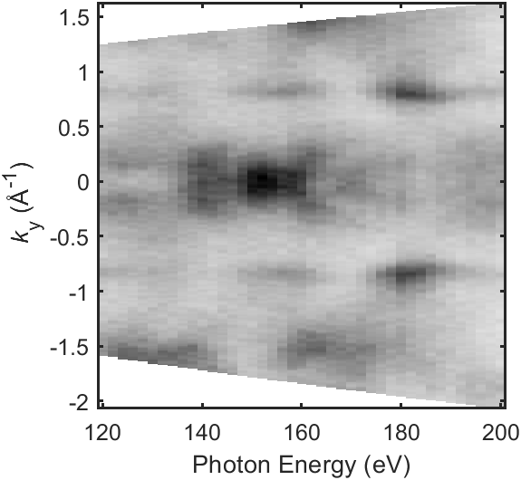

# Manual of `yulinARPES`: Chen group's ARPES data process software

This manual is intended to provide a brief introduction to using yulinARPES for processing and visualizing ARPES data. It will guide you through the basic workflow of ARPES data processing and help you become familiar with the software's structure.

Please note that this manual does not cover the principles of ARPES. If you would like to learn more about ARPES, we recommend referring to review articles on the topic, such as:

1. [Sobota, J. A., He, Y., & Shen, Z. X. (2021). Angle-resolved photoemission studies of quantum materials. Reviews of Modern Physics, 93(2), 025006.](https://arxiv.org/abs/2008.02378)
2. [Liu, Chang. Electronic structure of ion arsenic high temperature superconductors studied by angle resolved photoemission spectroscopy. United States. https://doi.org/10.2172/1029553](https://www.osti.gov/biblio/1029553/)

---
## Preparetion

To use the latest version of the software, please download the latest versions of `yulinARPES` [->Link](https://github.com/Calvin-Phys/yulinARPES) and `OX_ARPES` [->Link](https://github.com/Calvin-Phys/OX_ARPES), and add their folders to the Matlab path. Additionally, make sure that any necessary toolboxes (including the `GUI Layout Toolbox` in `\yulinARPES\manual\`) are installed. Once the folders have been added and the toolboxes installed, restart Matlab to ensure the changes are properly registered.

To launch the software, enter the following command into the Matlab command line:

```
data_browser_demo_v32
```

Press Enter to run the command, and the main window of the software will appear as shown below.


---
## Loader ARPES data

The program can load raw data into the workspace. To load data, click on 
```
Loader -> Load ARPES Data (New)
```

This will open the Loader window, as shown below:


You can select and load multiple files at once by using the file selection dialog.

> **What are the differences between the new and old loader?**
> 
> 1. The new loader differs from the old loader in that it loads raw data into pre-defined class objects (The data structure is defined in project `OX_ARPES`), whereas the old loader only produces raw Matlab structs. By using pre-defined class objects, the new loader can integrate more information (photon energy, polarisation, pass energy, scan mod, temperature ...) and provide processing methods (truncate, k-convert, normalise ...) for the data.
> 2. The new loader has enhanced compatibility with Dropbox. It can now access online Dropbox folders without any disruptions and selectively download desired data files.
> 3. The new loader can remember the last path it opened, which can save users time and effort when accessing frequently-used directories.
> 4. The new loader is being actively maintained and upgraded, and it usually has better compitablity and speed.
> 
> It is recommended to use the new loader due to its added functionality, but the old loader remains available within the software.
>
> **How to convert the data loaded by the new loader to Matlab structure that is compitable with some older programs?**
>
> This can be done by calling the `struct` function in Matlab. For example,
> ```
> new_Cut = struct(Cut)
> ```
> will convert the object with class to a simple structure.

Once the loading process is finished, click on the list in the main window to refresh it. The newly-loaded data variables will then appear in the list.


> ### Example data
> some example data can be downloaded from this link [Google Drive](https://drive.google.com/file/d/1RBRQpuCB2nDpFHBzyuazKtsqrcoOazK8/view?usp=sharing).

---
## Visualisation

After loading the data into the workspace, you can double-click on it to plot the data. For 3D data, it will be plotted along the z direction by default. To change this, you can right-click on the plot and select 
```
plot -> plot along x/y/z.
```

The data plot window will look like this:


You can:
- adjust the color map range with the sliders to set the minimum and maximum percentages. `Fix Clim` option decides whether percentages are set only for current slice or the entire data. 
- To change the contrast, adjust the `/gamma` slider. When gamma is zero, the image has a log scale.
- Change the color map by selecting a new option from the drop-down list. To flip the color map, check or uncheck the `Flip` checkbox.
- Enable interpolation of the data by selecting the `Interp` option
- Enable `Cursor` to plot a crosshair on the figure, and the position of the crosshair is shown in the field right to the checkbox.


If you are working with 3D data, you can also:
- change the position along the axis that you are plotting by using the top slider. Additionally, you can adjust the integration range by entering a value in the `Width` field.

### Energy and Momentum Distribution Curve (EDC/MDC)

To view the EDC and MDC of a cut, click on the `ARPES Tools` menu and select `EDC/MDC`. 
```
ARPES Tools -> EDC/MDC
```
This will open the EDC and MDC windows alongside the plot window, as shown below:


You can move the solid-line crosshair to change the integration area, and move the dashed-line crosshair to change the integration range.

### Image Interpolation

If the resolution of the cut is not sufficient, you can turn on the interpolation of the plot by clicking on
```
ARPES Tools -> Interpolate
```
or selecting the `Interp` option on the main panel.
This will improve the visualization of the data. 

Here is an example (left without interpolation, right with interpolation):


### Mass plot

To plot a 3D data slice by slice, you can use the Mass Plot function. First, click on `New Plot` and select `Mass Plot`.
```
New Plot -> Mass Plot
```


Next, enter the desired number of columns, rows, and the position array. This will generate a large figure that displays the 3D data slice by slice.


---
## K-space convertion

The latest version of the software provides a convenient and accurate way to convert raw data to k-space.

> Before converting to k-space, it's important to ensure that the data has the correct **photon energy** and **work function**. If the data was collected in certain forms (such as `hdf5` at DLS), this information is already included by the loader program. However, if the information is not included in the raw data (which can happen for data created by the Scienta SEC program in the form of .txt or .zip files), you may need to add this information manually.
> - The photon energy and work function are stored in `data.info.photon_energy` and `data.info.workfunction`, respectively.

Now that all necessary information has been obtained, let's go through each type of data.

### Cut

Plot the cut. Enable `Cursor` option to plot the crosshair. Move the vertical line of the crosshair to the center of symmetry (i.e., K = 0), and then click on `ARPES Tools` and select `K-Convert (object)`.
```
Plot Window -> ARPES Tools -> K-Convert (object)
```
Wait for a moment the variable converted to k-space would appear in the main windows's list.


### Map

Plot the map along z direction, and enable the crosshair. Move the centre of the crosshair to the centre of symmetry (i.e., Kx = Kx = 0), and then click on `ARPES Tools` and select `K-Convert (object)`.
```
Plot Window -> ARPES Tools -> K-Convert (object)
```


Then there will be a dialog box asking about the azimuth offset for the conversion process. Input the degree to offset and click on the OK button.


### KZ

To convert a photon energy scan map to k-space, you can first plot it along either the z or x direction. If you plot it along the z direction, move the horizontal line of the crosshair to the vertical center of symmetry (i.e., Ky = 0). Alternatively, if you plot it along the x direction, move the vertical line to the horizontal center (i.e., Kx = 0).

Once the crosshair is properly positioned, click on `ARPES Tools` and select `K-Convert (object)`. 
```
Plot Window -> ARPES Tools -> K-Convert (object)
```
When prompted, input the `inner energy (V0)` of the material. This will convert the data to k-space and add it to the main window's list.


The constant energy cut of the converted data looks like this


### KZ (another type)
We found that another way to convert the photon energy scan is useful in some cases. The x axis will still be the photon energy instead of $k_Z$.



To achieve this result, please follow the steps below:

1. add the theta Y offset in degree to `[DATA_NAME].info.thetay_offset`
2. call the k-conversion method by typing in the command window
```
[DATA_NAME]_khv = [DATA_NAME].kconvert_type2();
```

---
## Data process

Basic data process includes:
- truncate data
- normalise data
- fit fermi level and offset
- combine photon energy scan cuts to 3D kz maps

### Data truncate

Truncating data means cutting a selected range of data. To do this, click on the main window's menu and select
```
Main Window -> Process -> Data truncate
```


Next, select the target data from the main window's list, input the truncate range, and click `Truncate Data`. A new truncated data will appear in the list.

### Data normalise

Self-normalizing the data can make unclear features of the data more apparent. To do this, click on the main window's menu and select 
```
Main Window -> Process -> Self Normalization.
```


Select the target data from the main window's list, select the normalization direction, and click `Normalize`. The normalized data will be produced.

### Fermi Edge correction

Sometimes the Fermi edge of the data we got is curved and we would like to make it straight and flat. This can be done by, firstly plotting the data and adjusting the figure to make sure the Fermi edge is clear, and then click

```
Figure Window -> ARPES Tools -> Fermi Surface correction
```
to select a few point on the Fermi edge.


Finally, press ENTER and save the data.


### Fit Fermi level and offset

> Note that the `Fit Fermi Level` feature is only useful for correcting the work function and is not used to convert kinetic energy to binding energy, which is done automatically by the `K-Convert` function.

Open the window by
```
Main Window -> Tool -> Fit Fermi Level
```


Then, follow these steps:
1. Find the figure number of the target plot and enter it in the `Figure Number` field of the `FitFermiSurface` window. 
2. Click `Get EDC From Figure` button, and draw a square on the plot to select the integration area.
3. An EDC of the selected area will appear in the `FitFermiSurface` window. Click `Fit FS` button. 
4. Repeat steps 2-3 if the fitting is not satisfactory. When the fitting looks good enough, click `Offset Energy` button. A new variable will appear in the workspace.

### Combine Data for KZ

This tool helps you combine 2D cuts at different photon energies into a 3D kz map. To open the window, follow these steps:
```
Main Window -> Process -> Combine Data for KZ
```


1. Click on Refresh Variables to update the variable list.
2. Select all the relevant cuts, input the photon energy array, the work function, and the new map name.
3. Click on Combine 2D Cuts and wait for a moment. The combined data will be created shortly.

Moreover, the tool has the capability to merge multiple 3D kz maps. To do this, follow the steps below:

1. Select the desired kz maps. Modify the new map name.
2. Click on `Combine 3D Data`.


## More Data Visualisation

### Brillouin zone and KZ plot

An essential aspect of ARPES data processing is overlaying the theoretical Brillouin zone on the experimental data. This overlay helps confirm the orientation of the measured sample and allows for the observation of band behaviors in different Brillouin zones.

To accomplish this, open the PlotBZ_V1 function by navigating to:
```
Main Window -> Visualization -> Plot BZ
```


Enter the crystal parameters and plot the Brillouin zone. The BZ can be displayed on the measured data or a blank figure.

For better experiment planning, you can also plot the cut positions in k-space for different photon energies. Open another window by selecting:
```
Main Window -> Visualization -> Plot cut in kz
```


Input the necessary parameters in the fields provided and click the Push it button. The line of a cut at a specific photon energy will be plotted in the target figure.

Below is an example of plotting the Brillouin zone and photon energy cuts together:


Several other functions for visualizing ARPES data are provided below. These operations are designed to be user-friendly and straightforward:

### EDC MDC line plot

```
Main Window -> Visualoztion -> EDC MDC plot
```


### Slice 3D plot

```
Main Window -> Visualoztion -> Slice 3D plot
```


### Volume with notch plot

```
Main Window -> Visualoztion -> Volume 3D plot
```


---
## Acknowledgments

This document is designed to consolidate the current data processing software manual and help new group members become familiar with it. Please note that the document is still under development and will be updated periodically.

The software and functions mentioned above are the collective contributions of numerous group members across various generations. This document serves as a valuable resource for preserving the software's usage and bringing together the knowledge and efforts of previous work.

You are encouraged to provide feedback, contribute new functions, or help maintain the software. Your input and collaboration are greatly appreciated.

---
Contact: Cheng Peng <cheng.peng@physics.ox.ac.uk>

Group web: [Chen Group | ARPES at Oxford](http://www.arpes.org.uk)